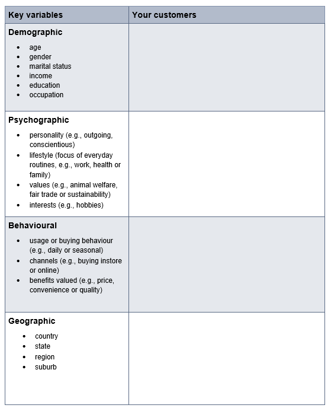
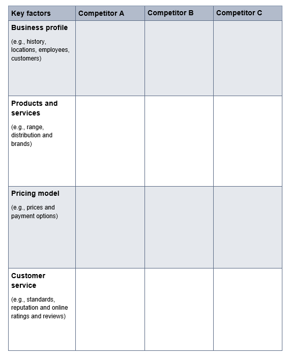
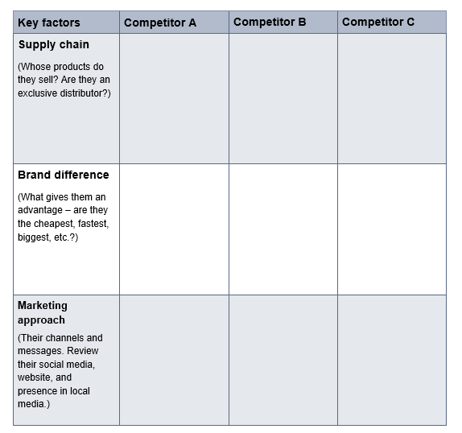

# Marketing Strategy

## know your current situation
- this step is known from the marketing research process, it all about getting insight about your **industry** and **customers** by gathering data using different resources and methods like documentations, roports, surveys, interviews, etc..
- **internal** and **external** review of the business
- knowing your business **SWOT**

## set your marketing objectives
1. it should meet the **SMART** criteria e:i specific, measurable, acheivable, relevant, time
2. it should covers different areas including 
    - building brand awareness
    - shifting customer perception
    - generating business leads
    - incresing sales volume
    - improving customer retention
    - boosting customer satisfaction
3. set your key performace indicators(**KPIs**) like
    - cost per acqusition (CPA)
    - return on investment (ROI)
    - return on ad spend(ROAS)
    - customer lifetime value
    - unique website visitors
    - social media engagement
> [!NOTE]
> Review and adjust your marketing objectives based on your progress.

## define your target customer segments
use the framework **STP** e:i segmentation, targeting, positioning

- summarize the finding of your customer research which will reveal
    - customers attitudes and behaviours in your industry
    - current and future needs for products and services

- then define your target segments
    - Choose the most appropriate way for you to segment the market (e.g. demographic, geographic, psychographic, behavioural).
    - Prioritise target segments based on relevant criteria for your business (e.g. potential value, brand differentiation, ability to serve).
    - Document a profile for each of your preferred target segments and then create personas(afictional characters, which you create based upon your research in order to represent the different user types that might use your service) to bring these to life in a meaningful way.

    

## do a competitive analysis

## define you brand positioning
- Brand positioning is much more than just your name or logo. This is your business purpose.
The ambition is to build a **distinctive brand**. This is about
1. what you want to be known for
2. want to own in the hearts and minds of your customers.

**define your value proposition**

a statement of the benefits you provide in exchange for payment

look to it in terms of the current situation and the ideal future

**It explains**:

- the promise of value you will consistently deliver to customers
- how your business model meets the needs and wants of customers.

## identify priority marketing programs
Marketing programs are specific initiatives or campaigns designed to achieve the goals outlined in a company's overall marketing strategy. They involve a set of coordinated activities that target key objectives such as increasing brand awareness, generating leads, or boosting sales.

# checklist
1. i know my business and the current market.
2. I've set clear, realistic, and measurable marketing objectives.
3. I've defined meaningful target segments.
4. I've defined my business's distinctive brand.
5. I've completed an analysis of my competitors.
6. I've identified the marketing programs I need to focus on.