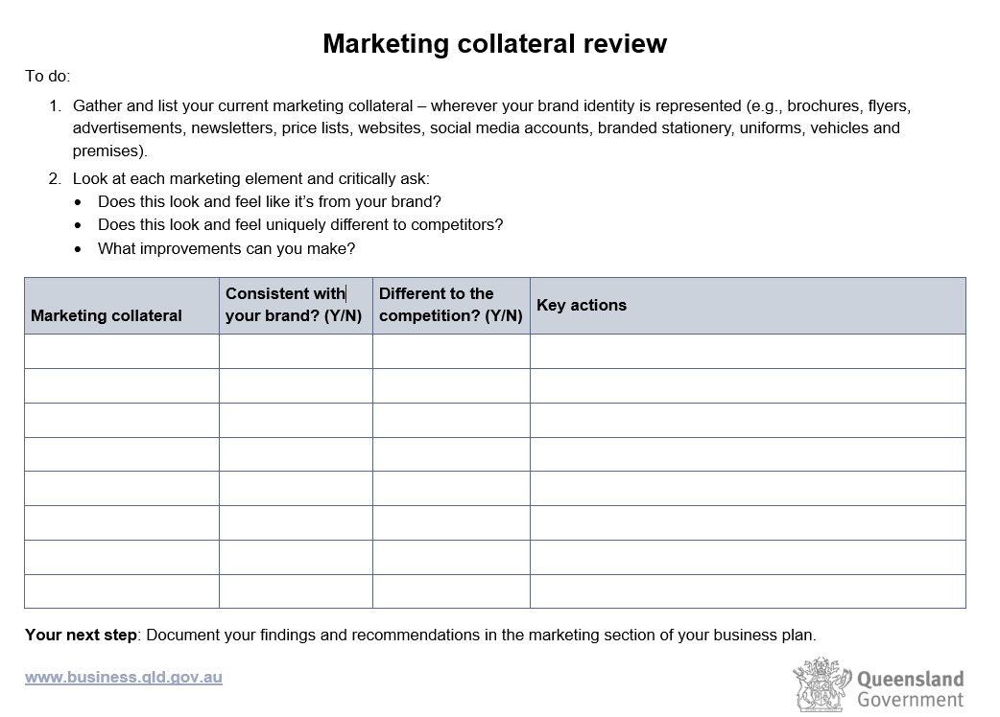

# branding
**your brand shows:**
- who you are
- what you stand for

A brand is much more than a name, logo and tagline.

It's **what comes to mind** when existing and potential customers think of you. It answers the question:

- What do you want to be known for?
- what your customers think and feel about your brand
- how they identify, recognise and experience your business.

**A brand is made up of 2 elements**:
- **tangible** (e.g. premises, uniforms, campaigns)
- **intangible** (e.g. reputation, service, behaviour).

a brand is simply a collection of perceptions in the mind of the consumer.

# Business and personal brand
the face of the brand is the founder, owner or leader. It's important that there's a natural and logical association between your business and personal brand.

**Ask yourself...**
- Do you need to update your profiles on social media platforms?
- Could you make better use of business and personal networking opportunities?
- Can you publish expert blog content your audience will find valuable?
- Do you need to brush up on your skills in business communication or how to deal with the media?

if you have a brand already, it is helpful to do **brand audit** to evaluate your performance from your customers perspectives
1. **determine brand audit goals: you may want to do to**
    - assess brand strengths and weaknesses
    - customers engagement has gone down
    - your business has changed
2. **collect data and revicw insight**
   **Depending on your resources, you can evaluate your brand by:**
    - asking your existing and potential customers through market research
    - reviewing data trends from primary sources (e.g. your sales figures, or social media and website data)
    - looking at direct and indirect competitors to see if their brand has changed
    - doing an internal survey to find out how much your employees understand and support your brand
    - using our template to review your marketing collateral.

    

3. **find solution and act**
- rate how well your actual brand matches up to your intended brand
- highlight and prioritise areas for improvement
- generate ideas based on customer insights
- add initiatives into your marketing action plan.

# Develop your business brand
To become distinctive, **your business brand must be:**
- **salient**بارز : your brand must be front of mind when customers are ready to act
- **different**: your brand must continue to stand out from your competitors
- **meaningful**: your brand must be understood by everyone involved.

1. review the **3Cs** of your brand (company, customers, competitors)
review of your current business status to help identify future opportunities.
2. define your brand postitioning to create a 1-page brand strategy
    - **vision**: the long-term ambition you have for your business
    - **purpose**: the 'why' of your business, the main reason (not financial) your business exists
    - **values**: the behaviour that your business supports and encourages
    - **promise**: your commitment to everyone involved with your business
    - **personality**: your voice, the tone, manner and style that represents your business
    - **proof**: the emotional and practical benefits your business delivers.